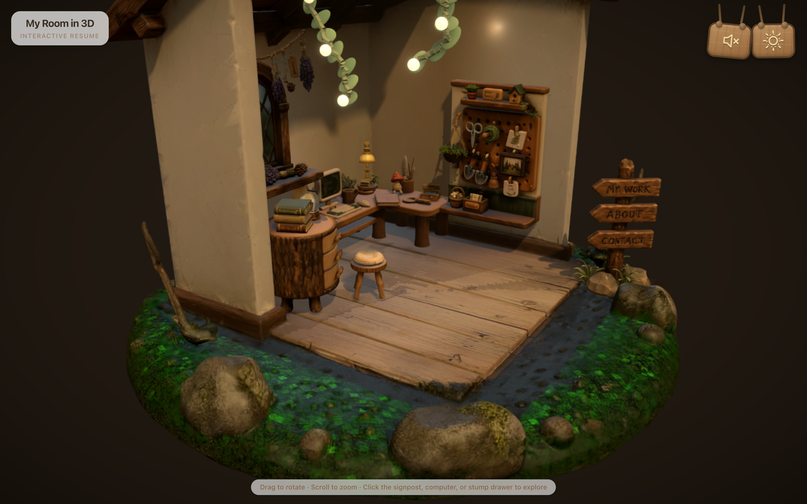
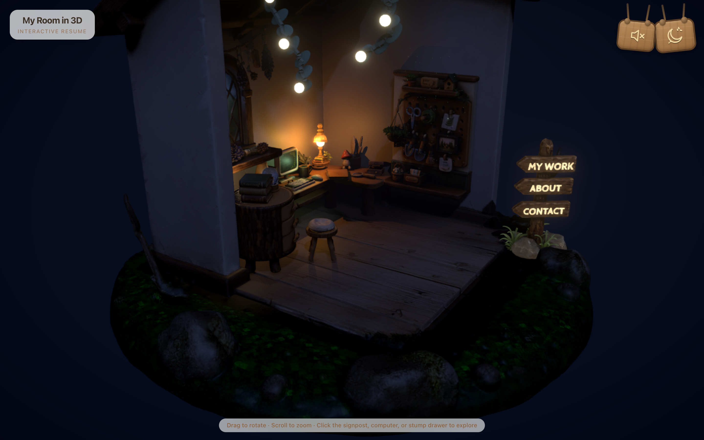

# My Room in 3D — Interactive Resume / 我的 3D 房间 — 交互式简历

**[English](#english)** · **[中文](#中文)**

<p align="center">
  
  
</p>

A cottagecore 3D room that works as an interactive resume. Orbit the diorama,
click the signpost boards, the computer screen, or the stump-cabinet drawer to
explore the content. Toggle day/night — at night the desk lamp throws real
shadows, the signpost labels glow, and a synthesized breeze + BGM ambience
plays.

**Live demo:** `<!-- TODO: add live demo link here -->`

---

<a id="english"></a>

## English

An open cottagecore 3D diorama you can explore — a resume disguised as a tiny
wooden room. Drag to rotate, scroll to zoom, then click around:

- **Signpost boards** (My Work / About / Contact) — GSAP camera fly-in,
  forest-themed modals.
- **Computer screen** — lean-in dolly + FOV zoom, then a retro cream-white
  monitor running "CottageOS": a typewriter hello.txt you can **really type
  into with your keyboard**, a click-to-plant garden toy, and a music app.
- **Stump-cabinet drawer** — pulls out a wooden drawer with hobbies,
  keepsakes, and skill badges.
- **Desk lamp** — day/night easter egg. At night its light casts real
  directional shadows; vine bulbs flicker.
- **Ambience** — synthesized breeze + looping BGM (two tracks). Mute from the
  wooden plank or the in-screen music app — both stay in sync.

Built with **React Three Fiber**, **GSAP**, **Tailwind CSS**, and **Vite**.

## Credits / Inspiration

- [Saad-Hisham/3d-room-portfolio](https://github.com/Saad-Hisham/3d-room-portfolio) 
- [andrewwoan/sooahs-room-folio](https://github.com/andrewwoan/sooahs-room-folio) 

## Getting started

```bash
npm install
npm run dev
```

Open the printed URL (default http://localhost:5173).

### Build for production

```bash
npm run build
npm run preview
```

## Customising your content

All text lives in **`src/content.js`**:
- `boards` — the three signpost sections (`work` / `about` / `contact`)
- `collections` — the stump drawer (hobbies / keepsakes / skill badges)

Replace the placeholders with your own info; no 3D code needs to change.

## Customising the scene

- **Furniture & shell** — everything loads from one Draco+WebP compressed GLB
  (`public/models/cottagecore-web.glb`), authored in `blender/`.
- **Lighting & post-processing** — `src/components/Scene.jsx` (day/night rigs,
  Bloom, vignette, film grain).
- **Interactions & night glow** — `src/components/Cottage.jsx`:
  - `LAMP_HEAD` / `LAMP_LIGHT` — bulb sphere & shadow-casting light positions
  - `BOARD_LABELS` — signpost glowing labels, with per-board `h` (height) and
    `dx`/`dy`/`dz` offsets
  - `COMPUTER_HIT` / `STUMP_HIT` — hitboxes for the screen and drawer
  - `DEBUG_HOTBOXES` — paint all invisible hit proxies in color while tuning
- **Camera limits** — OrbitControls azimuth/polar clamps in `Scene.jsx`.
- **Audio** — `src/audio.js` (breeze synth, track list, mute sync).

## Interaction model

- **Hover** any interactive object → floating label appears.
- **Click** → GSAP tweens the camera to the object, then a themed modal opens
  (forest sign / monitor screen / wooden drawer).
- **Click the desk lamp** → day/night easter egg toggle.
- **Click empty space / ✕ / Esc** → back to overview.

Hover labels are written to the DOM every frame via a ref (not React state), so
they track smoothly without re-rendering the tree.

## Performance

- `PerformanceMonitor` adapts DPR between 1–2× under load.
- High-poly Tripo meshes have CPU raycast disabled; interaction uses invisible
  low-poly hit proxies.
- Shadow-casting lights: sun (day) + desk lamp (night), 2048²/1024² maps.

## Project structure

```
src/
├── App.jsx               # HTML overlay + Canvas mount + toggle planks
├── content.js            # ← edit your resume here (boards, collections)
├── store.js              # zustand store (active/hovered/night/…) + label ref
├── audio.js              # ambience: breeze synth, BGM tracks, mute sync
├── index.css             # Tailwind layers + overlay styles
└── components/
    ├── Scene.jsx         # lighting rigs, camera tween, OrbitControls, post FX
    ├── Cottage.jsx       # GLB loading, hit proxies, lamp glow, signpost labels
    ├── ForestModal.jsx   # signpost content modal
    ├── ScreenModal.jsx   # CottageOS monitor (hello.txt / garden / music)
    ├── StumpDrawerModal.jsx # stump-cabinet collection drawer
    ├── Loader.jsx        # fade-out loading veil
    └── ErrorBoundary.jsx # WebGL failure fallback
```

## Tech stack

- React 18 + Vite 5
- @react-three/fiber + @react-three/drei + three
- @react-three/postprocessing (Bloom, Vignette, Noise)
- gsap (camera tweens, label fade-in)
- zustand (scene ↔ overlay state)
- tailwindcss (overlay UI)

## License

MIT — use it for your own resume.

---

<a id="中文"></a>

## 中文

一个可以探索的开放式田园风（cottagecore）3D 小屋——一份伪装成小木屋的交互式简历。
拖拽旋转、滚轮缩放，然后到处点点看：

- **路牌板子**（My Work / About / Contact）— GSAP 镜头飞入，森林风模态框。
- **电脑屏幕** — 推轨 + FOV 镜头推近，白色复古显示器里运行 "CottageOS"：
  可以**用真实键盘打字**的 hello.txt、点击种花小玩具、音乐播放器。
- **树桩柜抽屉** — 拉出木质抽屉，展示爱好、收藏品、技能徽章。
- **台灯** — 日/夜切换彩蛋。夜晚灯光投出真实方向影子，藤蔓灯泡闪烁。
- **氛围音** — 合成微风 + 循环 BGM（两首曲目）。木牌或屏幕内音乐 app
  均可静音，两边状态实时同步。

基于 **React Three Fiber**、**GSAP**、**Tailwind CSS** 和 **Vite** 构建。

## 致谢 / 启发

- [Saad-Hisham/3d-room-portfolio](https://github.com/Saad-Hisham/3d-room-portfolio) — 开场"房间生长"逐件入场动画、自适应 DPR 方案
- [andrewwoan/sooahs-room-folio](https://github.com/andrewwoan/sooahs-room-folio) — 田园风场景布局与参考尺寸

## 快速开始

```bash
npm install
npm run dev
```

打开终端输出的地址（默认 http://localhost:5173）。

### 生产构建

```bash
npm run build
npm run preview
```

## 修改你的内容

所有文字都在 **`src/content.js`**：
- `boards` — 路牌三个板块（`work` / `about` / `contact`）
- `collections` — 树桩柜抽屉（爱好 / 收藏品 / 技能徽章）

替换占位内容即可，无需改动 3D 代码。

## 定制场景

- **家具与房屋** — 全部来自一个 Draco+WebP 压缩的 GLB
  （`public/models/cottagecore-web.glb`），在 `blender/` 中制作。
- **灯光与后期** — `src/components/Scene.jsx`（日/夜灯光组、Bloom、暗角、胶片颗粒）。
- **交互与夜晚发光** — `src/components/Cottage.jsx`：
  - `LAMP_HEAD` / `LAMP_LIGHT` — 灯泡光球与投影点光位置
  - `BOARD_LABELS` — 路牌发光文字，每块板可调 `h`（高度）和
    `dx`/`dy`/`dz` 偏移
  - `COMPUTER_HIT` / `STUMP_HIT` — 电脑屏幕与抽屉热区
  - `DEBUG_HOTBOXES` — 调坐标时给所有隐形热区着色
- **相机限制** — `Scene.jsx` 里 OrbitControls 的方位角/俯仰角钳制。
- **音频** — `src/audio.js`（微风合成、曲目列表、静音同步）。

## 交互模型

- **悬停** 任意可交互物件 → 出现浮动标签。
- **点击** → GSAP 镜头飞向物件，随后打开对应主题的模态框
  （森林木牌 / 显示器屏幕 / 木质抽屉）。
- **点击台灯** → 日/夜切换彩蛋。
- **点击空白处 / ✕ / Esc** → 回到全景。

悬停标签通过 ref 每帧直接写 DOM（不走 React state），平滑追踪且不触发重渲染。

## 性能

- `PerformanceMonitor` 根据负载在 1–2× 之间自适应 DPR。
- 高面数 Tripo 网格禁用了 CPU 射线检测，交互使用不可见的低面数热区代理。
- 投影光源：白天太阳 + 夜晚台灯，2048²/1024² 阴影贴图。

## 项目结构

```
src/
├── App.jsx               # HTML 覆盖层 + Canvas 挂载 + 木牌按钮
├── content.js            # ← 在这里编辑你的简历（boards、collections）
├── store.js              # zustand store（active/hovered/night/…）+ 标签 ref
├── audio.js              # 氛围音：微风合成、BGM 曲目、静音同步
├── index.css             # Tailwind 层 + 覆盖层样式
└── components/
    ├── Scene.jsx         # 灯光组、镜头补间、OrbitControls、后期特效
    ├── Cottage.jsx       # GLB 加载、热区代理、台灯光球、路牌发光文字
    ├── ForestModal.jsx   # 路牌内容模态框
    ├── ScreenModal.jsx   # CottageOS 显示器（hello.txt / 花园 / 音乐）
    ├── StumpDrawerModal.jsx # 树桩柜收藏抽屉
    ├── Loader.jsx        # 淡出加载幕布
    └── ErrorBoundary.jsx # WebGL 失败兜底
```

## 技术栈

- React 18 + Vite 5
- @react-three/fiber + @react-three/drei + three
- @react-three/postprocessing（Bloom、暗角、噪点）
- gsap（镜头补间、标签淡入）
- zustand（场景 ↔ 覆盖层状态）
- tailwindcss（覆盖层 UI）

## 许可

MIT — 可用于你自己的简历。
