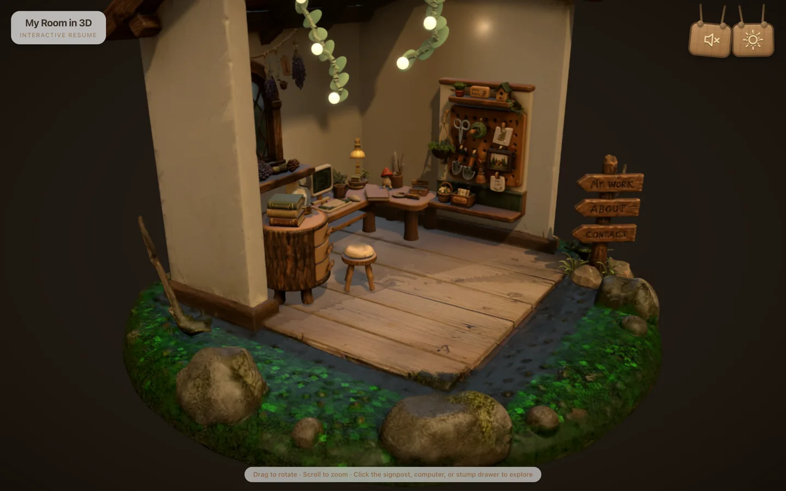
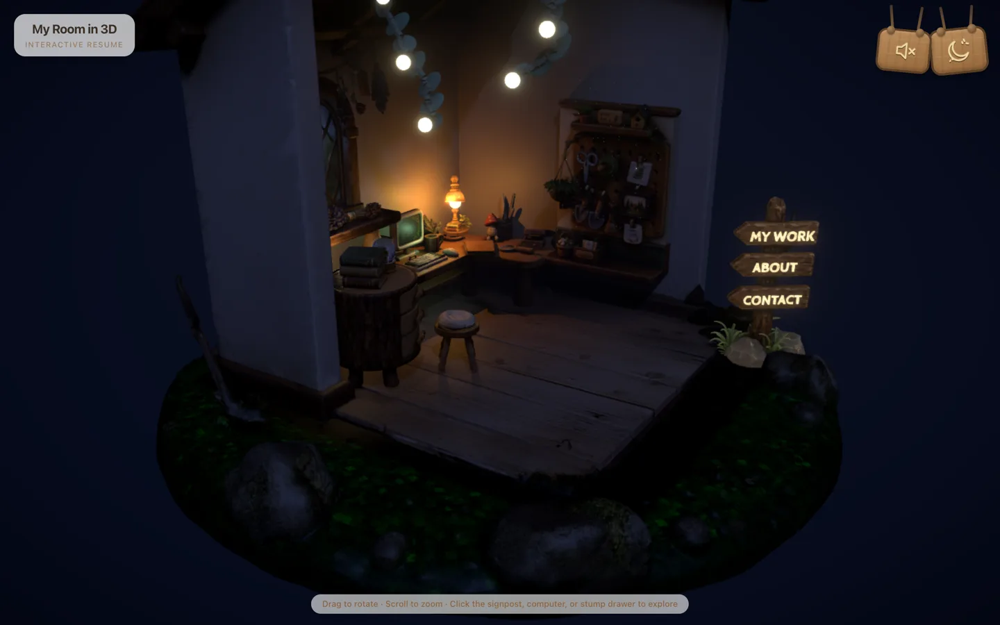
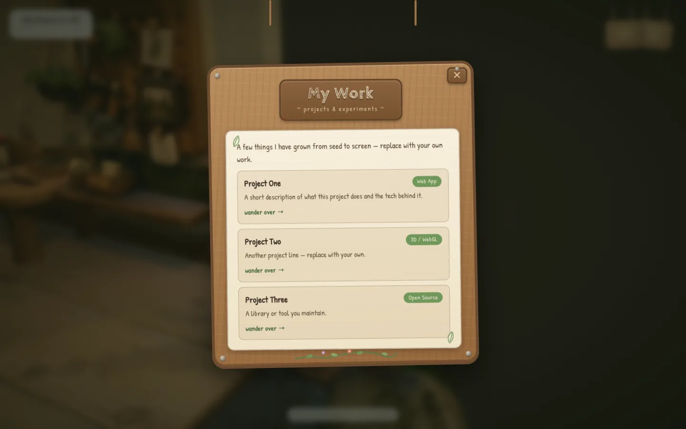
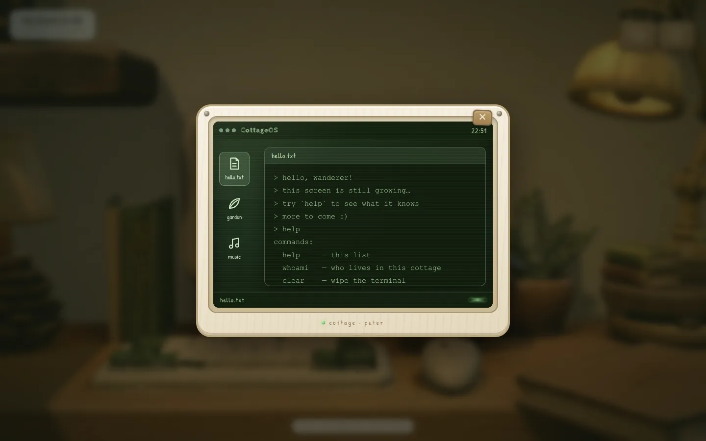
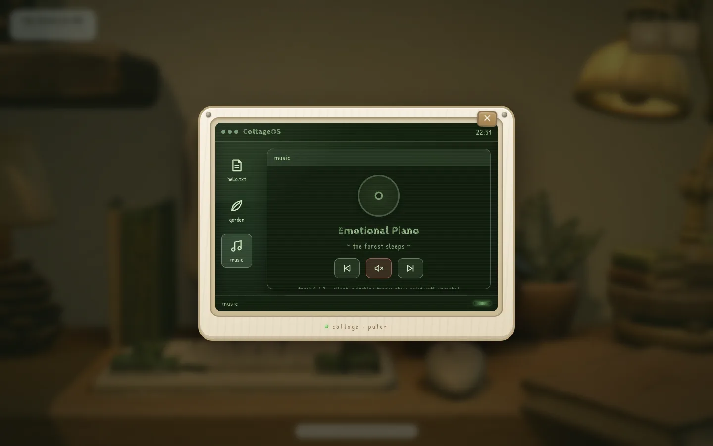
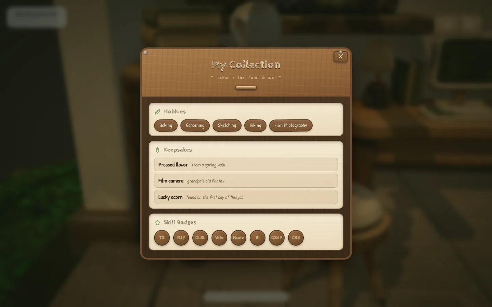

# 我的 3D 房间 — 交互式简历 / My Room in 3D — Interactive Resume

**[English](README.md)** · **中文**

<p align="center">
  
  
</p>

一个田园风（cottagecore）3D 房间，也是一份交互式简历。环绕游览小屋，点击路牌板子、电脑屏幕或树桩柜抽屉来探索内容。切换日/夜，整个场景会在两套灯光组之间交叉淡化 — 夜晚台灯和树桩玻璃球投出真实影子，路牌文字发光，还有合成微风 + BGM 氛围音。屏幕里的 "CottageOS" 终端甚至能听懂`day`/`night` 命令。

**在线演示：** <a href="https://lwowlwowl-room-folio.com" target="_blank" rel="noopener noreferrer">lwowlwowl-room-folio.com</a>

---

一个可以探索的开放式田园风（cottagecore）3D 小屋——一份伪装成小木屋的交互式简历。拖拽旋转、滚轮缩放，然后到处点点看：

- **路牌板子**（My Work / About / Contact）— GSAP 镜头飞入，森林风模态框
  
  <p align="center">
    
  </p>
  
- **电脑屏幕** — 推轨 + FOV 镜头推近，白色复古显示器里运行 "CottageOS"：可以**用真实键盘打字**的 hello.txt 终端 — 试试 `help`、`whoami`、`clear`、`day`、`night`（后两个会直接触发场景日夜交叉淡化）— 还有点击种花小玩具和音乐播放器。
  
  <p align="center">
    
    
  </p>
  
- **树桩柜抽屉** — 拉出木质抽屉，展示爱好、收藏品、技能徽章。

  <p align="center">
    
  </p>

- **日/夜切换** — 台灯彩蛋或右上角木牌。整个场景在两套灯光组之间**交叉淡化**（约 1.6 秒）：所有灯光、背景、雾、路牌发光文字、灯泡光晕一起渐变。夜晚台灯和树桩玻璃球投出真实方向影子。
- **氛围音** — 合成微风 + 循环 BGM（两首曲目）。木牌或屏幕内音乐 app 均可静音，两边状态实时同步。

基于 **React Three Fiber**、**GSAP**、**Tailwind CSS** 和 **Vite** 构建。

## 致谢 / 启发

- [Saad-Hisham/3d-room-portfolio](https://github.com/Saad-Hisham/3d-room-portfolio) — 开场"房间生长"逐件入场动画、自适应 DPR 方案
- [andrewwoan/sooahs-room-folio](https://github.com/andrewwoan/sooahs-room-folio) — 田园风场景布局与参考尺寸

## 快速开始

```bash
npm install
npm run dev
```

打开终端输出的地址（默认 http://localhost:5173）。

### 生产构建

```bash
npm run build
npm run preview
```

## 修改你的内容

所有文字都在 **`src/content.js`**：
- `boards` — 路牌三个板块（`work` / `about` / `contact`）
- `collections` — 树桩柜抽屉（爱好 / 收藏品 / 技能徽章）

替换占位内容即可，无需改动 3D 代码。

## 定制场景

- **家具与房屋** — 全部来自一个 Draco+WebP 压缩的 GLB（`public/models/cottagecore-web.glb`），在 `blender/` 中制作。
- **灯光与后期** — `src/components/Scene.jsx`（日/夜灯光组、Bloom、暗角、胶片颗粒）。
- **交互与夜晚发光** — `src/components/Cottage.jsx`：
  - `LAMP_HEAD` / `LAMP_LIGHT` — 灯泡光球与投影点光位置
  - `BOARD_LABELS` — 路牌发光文字，每块板可调 `h`（高度）和 `dx`/`dy`/`dz` 偏移
  - `COMPUTER_HIT` / `STUMP_HIT` — 电脑屏幕与抽屉热区
  - `DEBUG_HOTBOXES` — 调坐标时给所有隐形热区着色
  - `DEBUG_COORDS` — 世界坐标轴 + 地面网格 + 可调地标实时标记（热区、Scene.jsx 光源），调坐标用
- **日夜交叉淡化** — 两套灯光组常驻，`Scene.jsx` 补间一个共享 blend 值（1.6 秒），驱动所有灯光强度、背景/雾色、发光材质。`RIG` 表映射每盏灯的日/夜强度。
- **终端命令** — `src/components/ScreenModal.jsx`（`COMMANDS` 映射）： `help` / `whoami`（读  `boards.about`）/ `clear` / `day` / `night`。
- **相机限制** — `Scene.jsx` 里 OrbitControls 的方位角/俯仰角钳制。
- **音频** — `src/audio.js`（微风合成、曲目列表、静音同步）。

## 交互模型

- **悬停** 任意可交互物件 → 出现浮动标签。
- **点击** → GSAP 镜头飞向物件，随后打开对应主题的模态框（森林木牌 / 显示器屏幕 / 木质抽屉）。
- **点击台灯**或右上角木牌 → 日/夜交叉淡化（或在 CottageOS 里输入 `day`/`night`）。
- **点击空白处 / ✕ / Esc** → 回到全景。

悬停标签通过 ref 每帧直接写 DOM（不走 React state），平滑追踪且不触发重渲染。

## 性能

- `PerformanceMonitor` 根据负载在 1–2× 之间自适应 DPR。
- 高面数 Tripo 网格禁用了 CPU 射线检测，交互使用不可见的低面数热区代理。
- 投影光源：白天太阳；夜晚台灯、月光、树桩玻璃球，2048²/1024² 阴影贴图。交叉淡化中强度为 0 的一侧灯光会隐藏，阴影贴图停止渲染。

## 项目结构

```
src/
├── App.jsx               # HTML 覆盖层 + Canvas 挂载 + 木牌按钮
├── content.js            # ← 在这里编辑你的简历（boards、collections）
├── store.js              # zustand store（active/hovered/night/…）+ 标签 ref
├── audio.js              # 氛围音：微风合成、BGM 曲目、静音同步
├── index.css             # Tailwind 层 + 覆盖层样式
└── components/
    ├── Scene.jsx         # 灯光组、镜头补间、OrbitControls、后期特效
    ├── Cottage.jsx       # GLB 加载、热区代理、台灯光球、路牌发光文字
    ├── ForestModal.jsx   # 路牌内容模态框
    ├── ScreenModal.jsx   # CottageOS 显示器（hello.txt / 花园 / 音乐）
    ├── StumpDrawerModal.jsx # 树桩柜收藏抽屉
    ├── Loader.jsx        # 淡出加载幕布
    └── ErrorBoundary.jsx # WebGL 失败兜底
```

## 技术栈

- React 18 + Vite 5
- @react-three/fiber + @react-three/drei + three
- @react-three/postprocessing（Bloom、暗角、噪点）
- gsap（镜头补间、标签淡入）
- zustand（场景 ↔ 覆盖层状态）
- tailwindcss（覆盖层 UI）
